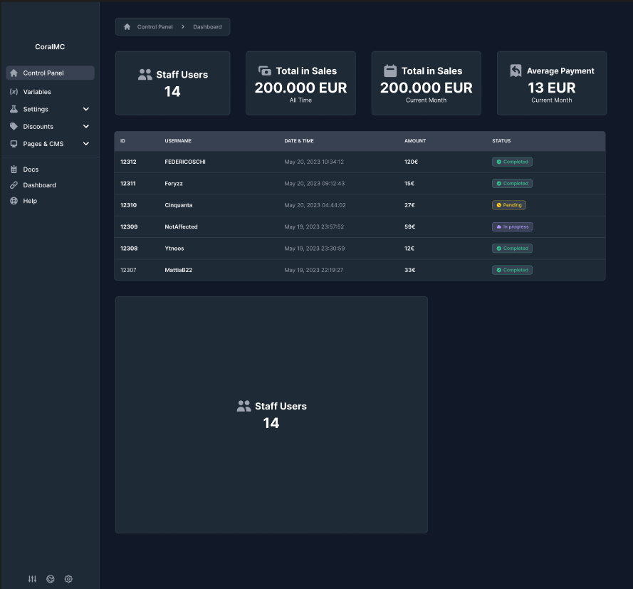

# CoralMC Dashboard
Questo progetto è stato sviluppato da MrLiam2614 sulla base delle indicazioni date dal Developer Lafa di CoralMC.

## Scopo
Il progetto deve andare a ricreare una dashboard il più fedelmente possibile

## Indicazioni
Le indicazioni date dal Developer Lafa sono le seguenti:
- Una webapp sviluppata in React (typescript è gradito, ma è un plus)
- Utilizzo di scss
- Caricare tutto su una repository github pubblica, utilizzando git per versioning tool cercando di utilizzarlo al meglio delle proprie capacità
- Non si possono usare librerie esterne
- Cercare di componentizzare dove possibile e di sfruttare le potenzialità di react al meglio possibile.
- Il drawer deve avere i sottomenu funzionanti
- Se si riesce avere la tabella ordinabile